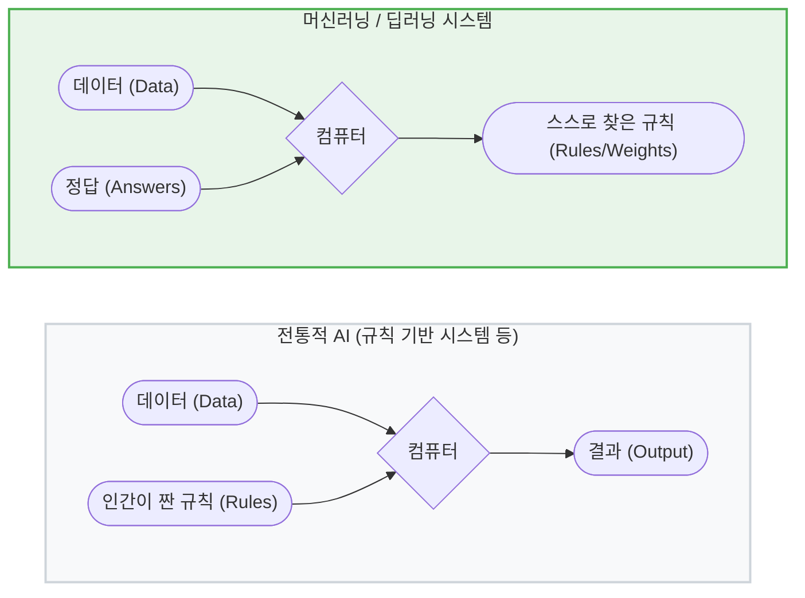

# 📖 Chapter: [CHAPTER1. 대규모 언어 모델 이해하기]

## 🧩 지식과 생각의 흐름 (Interleaved Notes)

> [!info] 책의 내용
> LLM은 사람의 텍스트를 이해하고, 생성하고, 응답하도록 고안된 신경망
> 

> [!question] Q1. 신경망이 뭐지?
> - **신경망**: 데이터의 패턴을 찾아내는 거대한 수학적 계산기에 가까움.
> - **신경망의 3가지 핵심 구조**: 
> 	1. 노드(Node, 인공 뉴런)
> 		- 우리 뇌의 뉴런 역할을 하는 아주 작은 계산 단위. 각 노드는 숫자를 하나씩 담고 있으며, 들어온 데이터를 간단한 수식으로 계산한 뒤 다음 노드로 전달
> 	2. 계층(Layer)
> 		- 노드들은 무질서하게 흩어져 있는게 아니라, 여러 겹의 층을 이루고 있음
> 		- **입력층(Input Layer)**: 우리가 입력한 질문("안녕?")을 컴퓨터가 이해할 수 있는 숫자 형태로 변환하여 처음 받아들이는 곳
> 		- **은닉층(Hidden Layer)**: 입력된 단어들의 맥락, 문법, 뉘앙스등 복잡한 패턴을 추출하고 분석. LLM은 이 은닉층이 수십에서 수백 겹으로 엄청나게 깁고 복잡하게 쌓여 있어서 **딥러닝(Deep Learning)**이라고 부름
> 		- **출력층(Output Layer)**: 은닉층의 수많은 계산을 거친 결과를 바탕으로 다음에 올 가장 자연스러운 단어나 문장을 확률로 계산하여 최종적으로 뱉어냄
> 		
> 	3. 가중치(Weight): 노드와 노드를 연결하는 선(모든 연결선이 같은 힘을 가진 것은 아님). 예를 들어 "사과"라는 단어 다음에 "맛있다"와 "노트북"이 올 확률은 다름. 신경망이 수 많은 문서를 읽고 **학습**한다는 것은, 바로 이 **수십억 ~ 수조 개의 연결선(가중치)들의 굵기를 가장 완벽한 비율로 조절해 나가는 과정**을 의미함.

---

> [!info] 책의 내용
> 대규모 언어 모델에서 대규모는 모델의 파라미터 크기와 대량의 훈련 데이터셋을 모두 의미합니다. 이런 모델은 수백 또는 수천억 개의 파라미터를 가지고 있으며, 모델 파라미터는 시퀀스의 다음 단어를 예측하도록 훈련하는 과정에서 조정되는 신경망의 가중치입니다. 다음 단어 예측은 언어의 고유한 순차 특징을 사용하여 텍스트 안의 맥락, 구조, 관계를 이해하는 모델을 훈련시키는 합리적인 방법입니다.

> [!question] Q1. 시퀀스가 뭘 말하는거지?
> - **시퀀스**: 컴퓨터 과학이나 수학에서 시퀀스는 **순서가 지정된 요소들의 배열**을 의미. 언어 모델에서 시퀀스는 단순히 텍스트를 구성하는 단어(또는 토큰)들이 **시간의 흐름에 따라 나열된 데이터 스트림**을 뜻함.
> 	- **예시**: `[대규모, 언어, 모델은, 정말, 놀랍다]`
> - **왜 시퀀스라는 단어를 썼지?**: 언어는 순서가 전부인 데이터임. "개가 사람을 물었다"와 "사람이 개를 물었다."는 구성 요소(단어)(사람 / 개 / 물다)는 완전히 같지만 순서(시퀀스)가 달라짐으 의미가 180도 바뀜. 즉 LLM에게 텍스트는 단순한 단어의 주머니가 아니라 앞뒤 문맥과 순서가 엄격하게 지켜지는 1차원 배열로 취급되며, 이를 시퀀스라고 부름

> [!question] Q2. "다음 단어 예측"이 왜 모델을 훈련시키는 합리적인 방법인거지?
> - **1. 맥락과 논리를 이해해야만 정답을 맞출 수 있음**: 다음 단어를 정확히 예측하려면 모델은 앞에 나온 시퀀스의 문법, 의미, 논리적 관계를 모두 파악해야만 함.
> 	- **문법적 이해**: 나는 어제 맛있는 밥을[?] -> 앞의 시퀀스를 보고 동사의 과거형(먹었다)이 와야 함을 수학적으로 계산
> 	- **의미론적 이해**: 그는 너무 피곤해서 침대애 [?] -> 피곤하다와 침대라는 맥락을 연결하여 누웠다를 유추
> 	- **논리적 추론**: A는 B보다 크고, B는 C보다 크다. 따라서 A는 C보다 [?] -> 단순한 단어의 통계적 빈도를 넘어 삼단논법 같은 논리적 구조까지 가중치(네트워크)에 저장해야만 크다 라는 정답을 맞출 수 있음.
> 	- 즉, 다음 단어를 예측하는 행위는 **언어의 복잡한 비즈니스 로직을 리버스 엔지니어링**하도록 모델을 압박하는 가장 확실한 테스트 기법
> 	
> - **2. 자기 지도 학습(Self-Supervised Learning)의 무한한 확장성**: 대규모 모델을 가능하게 한 가장 핵심적인 이유.
> 	- 과거의 AI 훈련은 사람이 일일이 라벨링을 해야 했음(머신러닝)
> 		- **예시**: 고양이 사진에 고양이라고 이름표 붙히기
> 	- 하지만 언어는 인터넷에 널려있는 수백 테라바이트의 텍스트 원문 그 자체가 **완벽한 문제집이자 정답지**
> 	- 문장 하나를 가져와서 마지막 단어를 가리면 그것이 곧 문제가 되고, 가렸던 단어를 다시 보여주면 정답이 됨.
> 	- 사람이 개입할 필요 없이 무한한 데이터로 시스템을 자동화하여 돌릴 수 있기 때문에 수천억 개의 파라미터를 학습시키는 것이 가능해짐.
> - **3. 언어의 본질적인 인과성(Causality) 반영**
> 	- 우리가 말을 하거나 글을 쓸 때도, 지나간 과거의 생각들을 바탕으로 다음 입 밖으로 낼 단어를 실시간으로 조합해 나감.
> 	- 다음 단어 예측은 인간이 언어를 생성하는 단방향적인(과거에서 미래로 흐르는) 사고 구조를 가장 자연스럽게 모방한 구조

---
> [!info] 책의 내용
> LLM은 예측을 수행할 때 입력의 다른 부분에 선택적으로 주의를 기울일 수 있는 **트랜스포머(transformer)** 구조를 활용하므로, 사람의 언어에 있는 뉘앙스와 복잡성을 다루는데 능숙함

> [!question] Q1. 트랜스포머 구조가 뭐지?
> **트랜스포머**는 2017년 구글이 발표한 논문("Attention Is all You Need")에서 처음 등장한 신경망 아키텍처.
> 트랜스포머가 인공지능 역사상 최고의 혁명으로 불리는 이유는 아래와 같음
> 
> - **1. 기존 모델의 한계: 순차 처리의 병목(RNN / LSTM)**
> 트랜스포머 이전의 언어 모델들은 텍스트를 순서대로(Sequential)처리 했음.
> "나는 어제 맛있는 밥을 먹었다."라는 문장이 들어오면 나는 -> 어제 -> 맛있는 순으로 하나씩 순차적으로 읽어나감.
> 	- **문제점**: 문장이 길어지면 앞에 읽었던 단어를 잊어버리는 기억력 손실(Vanishing Gradient)문제가 발생. 또한, 데이터를 순차적으로만 처리해야 하므로 시스템 아키텍처 관점에서 연산을 병렬화 할 수 없어 속도가 치명적으로 느림.
> 		
> - **2. 트랜스포머의 핵심: 셀프 어텐션(Self-Attention)**
> 트랜스포머는 텍스트를 순서대로 읽는 방식을 과감히 버리고, **문장 전체를 한 번에 통째로 입력**받음.
> 그리고 셀프 어텐션이라는 기법을 사용해 단어들 간의 관계를 계산.
> 이 매커니즘은 문장 안의 모든 단어가 서로에게 **"너 나랑 얼마나 연관되어 있어?"라고 질문을 던지고 가중치를 매기는 과정**
> 예를 들어 **"은행"**이라는 단어가 있을 때:
> 	- "나는 **은행**에서 돈을 찾았다" -> 은행은 돈, 찾았다에 강한 주의(Attention)를 기울여 금융 기관임을 파악
> 	- "길가에 **은행** 냄새가 진동한다" -> 은행은 냄새, 길가에 주의를 기울여 식물임을 파악
> 즉, 단어의 의미를 고정된 사전적 정의로 받아 들이는 것이 아니라, **주변 어떤 단어들과 함께 쓰였는지(Context)를 동적으로 파악**하여 미묘한 뉘앙스까지 완벽하게 잡아냄
> 	
> - **3. 압도적인 효율: 병렬 처리**
> 순서대로 단어를 처리할 필요가 없어지면서, 트랜스포머는 문장 내의 모든 단어 관계를 GPU를 활용해 **동시에(병렬로) 계산** 할 수 있게 됨.
> 데이터 파이프라인의 병목 현상이 해결되며 무한에 가까운 인터넷 데이터를 빠르게 학습할 수 있게 되었고, 이것이 지금의 대규모 모델을 탄생시킨 결정적 계기가 됨.

---
> [!info] 책의 내용
>  머신러닝은 AI 구현에 사용되는 알고리즘을 개발하는 데 초점을 맞추고 있음.
>  특히 머신러닝은 명시적으로 프로그래밍하지 않고도 데이터로부터 학습하고, 데이터를 기반으로 예측하거나 결정을 내릴 수 있는 알고리즘을 개발.
>  머신러닝과 딥러닝이 AI 분야를 지배하고 있지만 규칙 기반 시스템, 유전 알고리즘, 전문가 시스템, 퍼지 논리, 기호추론과 같은 다른 접근 방법도 있음.

> [!question] Q1. AI를 위한 접근 방법이 머신러닝과 딥러닝 말고도 많은데, 왜 하필 머신러닝과 딥러닝이 지배하고 있는거지?
> - **1. 패러다임의 전환: 규칙은 누가만들어?**
> 가장 근본적인 이유는 컴퓨터에게 명령을 내리는 데이터 파이프라인의 구조 자체가 완전히 뒤집힘.
> 	 - **전통적 AI(규칙기반)**: 개발자가 if A then B라는 규칙을 일일이 타이핑해서 컴퓨터에 넣어야 함
> 	 - **머신러닝**: 개발자는 데이터와 정답만 주고, 컴퓨터가 그 안에서 수학적으로 **규칙(가중치)**을 스스로 도출
> 	 
> - **2. 현실 세계의 복잡성: "고양이 딜레마"**
> 사람이 직접 규칙을 짜는 것이 한계에 부딪힌 이유를 고양이 딜레마라고 부름
> 	- 규칙1: 뾰족한 귀가 두 개 있어야 한다.
> 	- 규칙2: 꼬리가 있어야 한다.
> 	- 규칙3: 수염이 있어야 한다.
> 	  
> **문제 발생**: 만약 고양이가 뒤돌아 있어서 꼬리만 보인다면? 어둠 속에 숨어서 실루엣만 보인다면? 품종이 달라서 귀가 접혀있다면?
> 현실 세계의 비정형 데이터(이미지, 음성, 자연어)는 너무 복잡하고 변수가 많아서 인간이 이 모든 예외 상황을 if-else문으로 코딩하는 것은 물리적으로 불가능함.(이를 규칙의 폭발 현상이라함)
> 반면, 딥러닝은 수십만 장의 고양이 사진을 보고 픽셀 단위의 미묘한 패턴을 수천만 개의 가중치(네트워크)로 자동 저장해버림. 인간의 언어로는 설명할 수 없는 추상적인 '고양이의 느낌'을 수학적으로 이해
> 
> - **3. 머신러닝(ML)/딥러닝(DL)이 지배하게 된 3가지 시대적 원인**
> 머신러닝과 딥러닝 알고리즘 자체는 1980년대에도 존재했음
> 하지만 최근 10년 사이에 폭발적으로 AI분야를 지배하게 된 이유는 3가지 원인이 존재.
> 	- **빅 데이터의 폭발(The Fuel)**: 인터넷과 스마트폰이 보급되면서, 머신러닝이 학습할 수 있는 텍스트, 이미지, 로그 데이터가 무한대로 쏟아짐. (전통적인 AI는 데이터가 많아진다고 똑똑해지지 않지만 DL은 데이터가 많을수록 성능이 선형적으로 증가)
> 	- **GPU 하드웨어의 혁명(The Engine)**: 딥러닝은 엄청난 양의 단순 행렬 곱셈 연산을 요구함. 과거의 GPU로는 수십 년이 걸릴 연산을, 게임 그래픽용으로 발전하던 NVDIA의 GPU가 수천 개의 코어로 병렬 처리해 내면서 물리적인 연산 속도 병목을 박살냄
> 	- **특징 추출의 자동화(Feature Engineering)**: 과거 전통적 머신러닝조차도 데이터에서 어떤 특징을 볼지 인간이 정해줘야했음. 하지만 딥러닝은 **무엇을 학습해야할지 조차 스스로 알아냄**

---
> [!info] 책의 내용
> 대부분의 최신 LLM은 2017년 논문 ["Attention Is All You Need"](https://arxiv.org/abs/1076.03762)에서 소개 된 심증 신경망 구조인 트랜스포머를 기반으로 함.
> LLM을 이해하려면 영어 텍스트를 독일어와 프랑스어로 번역하는 기계 번역을 위해 개발 된 원본 트랜스포머를 알아야 함.
> 트랜스포머 구조는 2개의 서브모듈인 인코더와 디코더로 구성되며,
> 인코더 모듈은 입력 텍스트를 처리하여 입력의 문맥 정보를 포착하는 일련의 수치 표현 또는 벡터로 인코딩 함.
> 그런 다음 디코더 모듈이 인코딩된 벡터를 받아 출력 텍스트를 생성
> 번역 작업을 예로 들면 인코더는 원본 언어의 텍스트를 벡터로 인코딩하고, 디코더는 이 벡터를 디코딩해 타깃 언어로 된 텍스트를 생성
> 인코더와 디코더 모두 이른바 셀프어텐션 메커니즘으로 연결된 많은 층으로 구성되어 있음.

> [!question] Q1. 인코더와 디코더의 차이는?
> - **인코더**: 완벽한문맥 압축기
> 	- 인코더의 유일한 책임은 **입력된 텍스트를 읽고, 단어들 간의 관계를 완벽하게 파악하여 숫자(벡터)로 압축하는 것**
> 		- **동작방식(양방향 스캔)**: 인코더는 문장 전체를 한 번에 봄. 즉, 현재 단어의 의미를 파악하기 위해 **과거의 단어와 미래의 단어를 모두 볼 수 있음**
> 			- 예: "The bank of the river" -> bank를 이해하기 위해 뒤에 있는 rever를 미리 보고 강둑이라는 의미로 확정
> 		
> - **디코더**: 엄격한 순차적 생성기
> 	- 디코더의 책임은 인코더가 넘겨준 값을 바탕으로 **다음 단어를 하나씩, 순서대로 생성하는 것**
> 		- **동작 방식(단방향 스캔 - Masking)**: 텍스트를 생성할 때는 미래를 미리 알 수 없음. 따라서 디코더 내부의 셀프 어텐션은 **마스크(Mask)**를 씌워 아직 생성되지 않은 미래의 단어들을 수학적으로 가려버림. 오직 자신이 방금 전까지 뱉었던 과거의 단어들만 참조할 수 있음(이를 Autoregressive, 자기 회귀 방식이라고 함.)
> 	
> - **크로스 어텐션(Cross-Attention)**: 두 시스템을 연결하는 다리
> 	- 인코더와 디코더는 독립적으로 동작하지만, 디코더가 번역 또는 요약을 제대로 하려면 반드시 인코더가 파악한 원본 문맥을 참조해야함.

---
> [!info] 책의 내용
> 원본 트랜스포머 인코더 모듈을 기반으로 하는 BERP(Bidirectional Encoder Representations from Transformers)는 GPT와 훈련 방식이 다름.
> GPT는 생성 작업을 위해 고안
> BERP는 주어진 문장에서 마스킹되거나 가려진 단어를 예측하는 마스킹된 단어 예측에 특화
> 이런 훈련 전략때문에 BERT는 감성 분석과 문서 분류를 포함헤 텍스트 분류작업에 강점을 갖게 됨
> GPT는 디코더 부분만 사용
> 텍스트 생성이 필요한 작업을 위해 고안
> 기계 번역, 텍스트 요약, 소설 쓰기, 컴퓨터 프로그램 작성에 강점

> [!question] Q1. 인코더를 사용하는 BERP는 어째서 감성 분석과 문서 분류 같은 강점을 가졌으며, 디코더를 사용하는 GPT는 왜 요약, 소설 쓰기, 프로그래밍에 강점을 갖게 된거지?
> - **BERT(인코더)**: 양방향 문맥파악 능력 때문
> 	- **시선의 방향**: 인코더는 마스킹없이 문장 전체를 한 번에 봄. 즉, 특정 단어의 의미를 파악하기 위해 과거(왼쪽)와 미래(오른쪽)의 데이터를 100% 모두 활용
> 	- **훈련 방식(빈칸 뚫기)**: "나는 오늘 [MASK] 가서 돈을 찾았다."라는 문장에서 빈칸을 맞추는 훈련을 진행. 빈칸을 정확히 채우기 위해 앞의 "나는 오늘" 뿐만 아니라 뒤의 "돈을 찾았다."라는 미래의 맥락까지 완벽하게 이해해야만 "은행에"라는 답을 도출 가능
> 	- **강점의 원인**: 문장의 처음부터 끝까지 모든 단어의 상관관계를 다방향으로 계산해 둔 상태(완벽한 컨텍스트 압축)이므로, 이 문장이 긍정인지 부정인지(감성 분석), 어떤 카테고리인지(문서 분류)를 판단하는 **'분석 및 검증' 작업에 시스템 리소스를 100% 쏟아부을 수 있음**
> 	
> - **GPT(디코더)**: 단방향 예측 시스템에 올인
> - **시선의 방향**: 디코더는 마스크드 어텐션(Masked Attention)을 사용하여 **자신의 오른쪽에 있는 단어(미래)를 보지 못하게 시스템적으로 차단**. 오직 왼쪽(과거)의 데이터만 보고 다음 스텝을 추론해야 함.
> - **훈련 방식(다음 단어 이어가기)**: "나는 오늘 은행에"가 주어지면 그다음 단어인 "가서"를 예측하고, "가서"를 맞추면 다시 그다음 단어를 예측하는 훈련이 끝없이 반복
> - **강점의 원인**: 훈련 방식이 **사람이 말을 하거나 글을 쓰는 방식과 100% 동일한 프로세스**. 우리도 말을 할 때 문장의 끝을 완벽히 정해놓고 말하기보다, 지금까지 뱉은 말을 바탕으로 다음 단어를 실시간으로 생성해냄. GPT는 이 '순차적 생성' 메커니즘만 극단적으로 고도화 해서 아무것도 없는 상태에서 유창한 텍스트를 지어내는 데 압도적인 성능을 발휘

---
> [!info] 책의 내용
> 원본 트랜스포머 구조와 비교하면 일반적인 GPT 구조는 비교적 간단.
> 기본적으로 인코더 없이 디코더 모듈만 사용
> GPT와 같은 디코더 기반의 모델은 한 번에 한 단어씩 예측하여 텍스트를 생성하기 때문에 자기 회귀 모델의 한 유형으로 간주
> 자기회귀 모델은 이전 출력을 입력으로 사용해 미래를 예측함.
> 결과적으로 GPT에서는 이전 시퀀스를 기반으로 다음 단어를 선택하는 식으로 출력 텍스트의 일관성을 향상.
> 원본 트랜스포머는 인코더 블록과 디코더 블록을 여섯 번 반복.
> GPT-3는 96개의 트랜스포머 층이 있으며 총 1,750억 개의 파라미터를 가짐

> [!question] Q1. GPT-3는 왜 하필 96개의 트랜스포머 층, 1,750억개의 파라미터를 가질까?
> 1. 1,750억(175B)개의 파라미터인 이유
> OpenAI 연구진들은 2020년 즈음에 **스케일링 법칙(Scaling Laws)**을 발견함.
> 모델의 크기(파라미터), 학습 데이터의 양, 그리고 컴퓨팅 파워(GPU)를 무식할 정도로 동시에 쏟아 부으면, 특정 임계점 없이 인공지능의 성능이 거듭제곱 법칙을 따라 계속 똑똑해진다는 사실을 알아냄
> 1,750억개(175B) 파라미터에는 별 철학이 있는게 아니라 그냥 당시 OpenAI가 끌어모을 수 있었던 수만 대의 GPU 클러스터와 수백억 원의 전기세/클라우드 비용을 태워서 돌릴 수 있었던 물리적이고 경제적인 최대치일 뿐.
> 
> 2. 왜 하필 96개의 Layers?
> 층을 1,000층이나 10,000층으로 깊게 쌓지 않은 이유는 시스템 아키텍처상의 명확한 이유가 있음.
> 
> **첫째, 기울기 소실(Vanishing Gradient)**
> 층이 너무 깊어지면 모델의 앞쪽 레이어까지 학습 신호(오차)가 전달되지 않고 희미해지는 현상이 발생하여 학습이 엄청나게 불안정해짐
> 
> **둘째, 텐서 코어(Tensor Core)와 마법의 숫자 128**
> GPT-3 아키텍처의 스펙을 완전히 분해해 보면 이런 숫자 조합이 나옴
> - 전체 모델의  차원 크기(Hidden Size): 12,288
> - 어텐션 헤드(Attension Heads)의 개수: 96개
> 12,288을 96으로 나누면 정확히 128이 떨어짐.
> 이 128이라는 숫자는 컴퓨터 아키텍처에서 아주 편안한 숫자, $2^7$
> NVIDIA GPU 내부에 있는 AI 전용 연산기인 텐서 코어는 행렬 곱셈을 할 때 데이터 덩어리가 64, 128, 256 같은 **2의 거듭제곱일 때 하드웨어 레벨에서 가장 미친 듯이 효율적으로 병렬처리**를 해냄

|            1라운드            |             2라운드              |                 3라운드                  |
| :------------------------: | :---------------------------: | :-----------------------------------: |
|  **[입력 텍스트]** "This"   |  **[입력 텍스트]** "This is"   |     **[입력 텍스트]** "This is an"     |
|             ⬇️             |              ⬇️               |                  ⬇️                   |
|        **[전처리 단계]**        |         **[전처리 단계]**          |             **[전처리 단계]**              |
|             ⬇️             |              ⬇️               |                  ⬇️                   |
|         **[디코더]**          |           **[디코더]**           |               **[디코더]**               |
|      ⬇️ *(다음 단어 예측)*       |        ⬇️ *(다음 단어 예측)*        |            ⬇️ *(다음 단어 예측)*            |
| **[출력 텍스트]** "This is" | **[출력 텍스트]** "This is an" | **[출력 텍스트]** "This is an example" |
|     ➡️ *2라운드 입력으로 전달*      |       ➡️ *3라운드 입력으로 전달*       |              🏁 *생성 완료*               |

---

## 🧐 최종 갈무리 (Synthesis)
*챕터를 마친 후, 전체 내용을 관통하는 나만의 결론을 내립니다.*

- **한 줄 정의:** 이 챕터는 결국 [ ]를 해결하기 위한 [ ]의 중요성을 말하고 있다.
- **핵심 Insight:** 기술적 복잡도를 낮추기 위해서는 단순한 구현보다 '책임의 분리'가 선행되어야 함을 다시 한번 깨달음.
- **남겨진 숙제:** 다음 장에서 설명할 [ ] 개념과 이 내용이 어떻게 연결될지 지켜볼 것.
