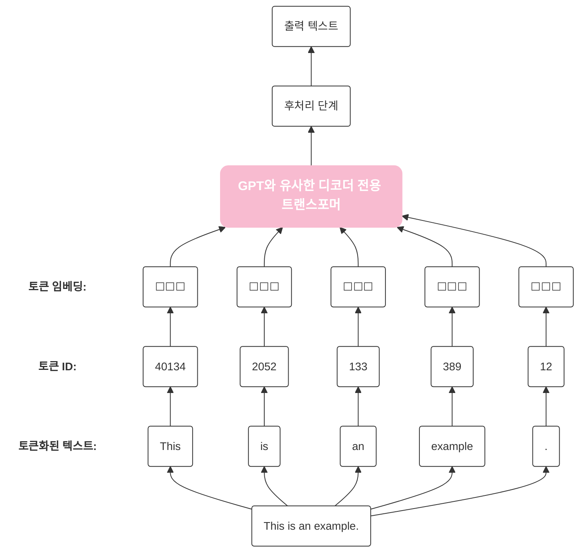
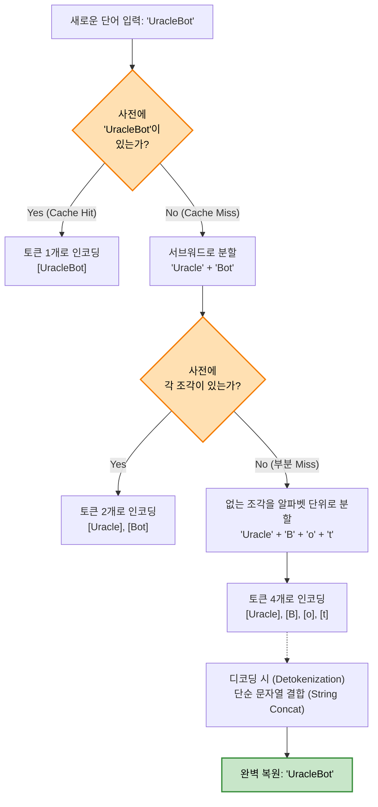
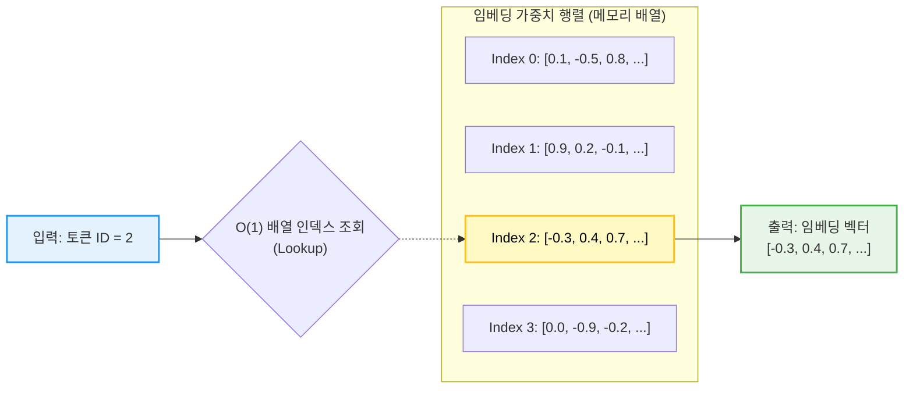

# 📖 Chapter: [CHAPTER2. 텍스트 데이터 다루기]

## 🧩 지식과 생각의 흐름 (Interleaved Notes)

> [!info] 책의 내용
> 심층 신경망 모델은 원시 텍스트를 바로 처리할 수 없으므로 단어를 실수 벡터로 표현할 방법이 필요.
> (토큰 id와 같은 정수로는 토큰 사이의 의도치 않는 순서 개념을 부여하게 되며, 이 정수를 원-핫 인코딩할 경우 모든 토큰 사이의 거리가 동일해져 비슷한 토큰 사이의 의미를 포착할 수 없음)
> 
> 데이터를 벡터 형태로 변환하는 개념을 **임베딩(embedding)**이라고 부름
> 비디오, 오디오, 텍스트등 다양한 종류의 데이터를 임베딩 할 수 있으나, 데이터 포맷마다 고유한 임베딩 모델이 필요
> 임베딩의 주요 목적은 비수치 데이터를 신경망이 처리할 수 있는 포맷(벡터)로 변환 하는 것
> 

> [!question] Q1. 원-핫 인코딩이란 뭐지?
> 원-핫 인코딩은 전체 단어의 개수만큼 빈칸(차원)을 만들고, 자기 자신의 자리에만 1을 킴
> 우리가 가진 전체 데이터(사전)에 단어가 딱 3개 뿐이라고 가정하면 `[사과, 바나나, 자동차]`
> - 사과: [1, 0, 0]
> - 바나나: [0, 1, 0]
> - 자동차: [0, 0, 1]
> 
> 그냥 1, 2, 3으로 안하고 이렇게 하는 이유
> 사과 = 1 / 바나나 = 2 / 자동차 = 3이라고 주면 컴퓨터는 수학적 계산기이기 때문에 "바나나가 사과보다 2배 크다", "사과 더하기 바나나는 자동차다."같은 어처구니 없는 수학적 오해가 생김(서열화 문제)
> 원-핫 인코딩은 모든 단어를 동등하게 독립적인 차원으로 찢어버리므로 이런 잘못된 관계 학습을 원천 차단함
> > [!warning] **원-핫 인코딩의 단점**
> > **1. 차원의 저주와 메모리 낭비**
> > 	- 단어 3개가 아닌 50만개의 단어를 인코딩 하게 되면 사과라는 단어 하나를 표현하기 위해 숫자 1개와 499,999개의 0이 들어간 거대한 배열을 메모리에 올려야 함.
> > 	
> > **2. 의미의 단절**
> >  - 수학적으로 이 벡터들은 서로 완전히 수직(직교)으로 교차함. 두 벡터를 곱해서(내적) 유사도를 구해보면 항상 0이 나옴.
> > 	 - `사과 [1, 0, 0]` x `바나나 [0, 1, 0]` = 0
> > 	 - `사과 [1, 0, 0]` x `자동차 [0, 0, 1]` = 0
> >  - 시스템 입장에서는 사과와 바나나는 과일이니까 비슷하다 라는 문맥을 전혀 알 수 없으며, 사과와 바나나나 사과와 자동차나 거리가 완전히 똑같이 멀게 느껴짐

> [!question] Q2. 인코딩을 정수로 하거나 원-핫 인코딩을 하면 문제가 생기는것은 알겠는데, 왜 하필 벡터로 인코딩?
> 벡터는 단어를 단순한 번호표가 아니라 **다차원 지도의 좌표(Coordinates)**로 만듬
> 시스템 아키텍처 관점에서 벡터가 혁명적인 이유 3가지
> 1. **차원의 세분화(다양한 속성의 저장)**
> 	- 정수는 1차원 선 위에 단어를 늘어놓는 것에 불과함. 벡터는 512차원, 1024차원이라는 거대한 다차원 공간을 사용하며, 이 수백 수천개의 차원(축)은 제각각 미묘한 의미를 담아냄.
> 	- 1번 차원: 성별을 나타내는 수치
> 	- 2번 차원: 왕족/귀족을 나타내는 수치
> 	- 3번 차원: 동물/식물을 나타내는 수치
> 	이런 식으로 한 단어가 가진 수많은 뉘앙스를 소수점 형태의 실수들로 쪼개서 정교하게 저장 가능
> 	
> 2. **기하학적 거리 측정(코사인 유사도)**
> 	- 좌표계가 생겼다는 것은 **'거리'**를 잴 수 있다는 뜻
> 	- 수많은 텍스트를 학습하는 과정에서, 같이 자주 쓰이는 단어들(예: 사과 / 바나나)은 다차원 공간에서 서로 중력처럼 끌어당겨져 좌표가 비슷해짐
> 	- 시스템은 두 벡터 사이의 각도(코사인 유사도)나 거리를 계산하여 "아 이 두 단어는 95%의 확률로 유사한 맥락을 가지는구나"라고 수학적 계산이 가능해짐
> 	
> 3. 의미의 연산(Vector Arithmetic)
> 	- 좌표계에 방향과 크기가 생겼기 때문에 **단어의 '의미'를 가지고 더하기 빼기 연산을 할 수 있게 됨**
> 	- 왕 - 남자 + 여자 = 여왕
>

---

> [!info] 책의 내용
> 단어 임베딩이 텍스트 임베딩의 가장 일반적인 형태
> 문장, 단락 또는 문서 전체를 위한 임베딩도 있음.
> 문장이나 단락 임베딩은 RAG(retrieval-augmented generation)에서 널리 사용
> 
> 초기에 등장한 단어 임베딩의 가장 인기있는 방법 중 하나는 **Word2Vec**
> 단어 임베딩의 차원은 하나에서 수천까지 가능. 차원이 높을수록 미묘한 관계를 잘 감지할 수 있지만 계산 효율성이 떨어짐
> 
> Word2Vec 같은 사전 훈련된 모델을 사용하여 머신러닝 모델을 위한 임베딩을 생성할 수도 있지만, LLM은 일반적으로 입력층의 일부로 자체적인 임베딩을 만들고 훈련중에 업데이트함.
> LLM 훈련의 일부로 임베딩을 최적화하면 임베딩을 특정 작업과 주어진 데이터에 최적화할 수 있다는 장점이 있음

---
> [!info] 책의 내용
> LLM을 위한 임베딩을 만드는 데 필수적인 전처리 단계인, 입력 텍스트를 개별 토큰으로 분할하는 방법은 개별 단어 또는 구두점 문자를 포함한 특수문자일 수 있음.



### 이디스 워튼의 단편소설 The Verdict(심판)을 샘플로 연습
```python
# "the-verdict.txt" 파일을 utf-8 인코딩의 읽기 모드("r")로 엽니다. (with 문이 끝나면 알아서 닫힙니다.)
with open("the-verdict.txt", "r", encoding="utf-8") as f:
    # 해당 텍스트 파일의 전체 내용을 불러와 하나의 문자열로 변수(raw_text)에 저장합니다.
    raw_text = f.read()
    # 전체 문자열의 길이(문자 및 기호의 총 개수)를 계산해서 화면에 출력합니다.
    print("총 문자 개수:", len(raw_text))
    # 데이터가 잘 불러와졌는지 확인하기 위해 처음부터 99개의 문자까지만 잘라서 출력해봅니다.
    print(raw_text[:99])

```

### 주어진 텍스트 토큰화
```python
import re # 파이썬의 정규표현식(Regular Expression) 처리를 위한 모듈을 불러옵니다.

# 1. 정규표현식을 기준으로 텍스트 분리 (토큰화)
# r'...'         : Raw String 표기법. 이스케이프 문자(\)를 문자 그대로 인식하게 합니다.
# (...)          : 캡처 그룹(Capture Group). 구분자(Delimiter)로 사용된 문자들도 사라지지 않고 결과 리스트에 포함되게 만듭니다.
#                  (LLM 전처리에서는 구두점도 중요한 문맥을 가지므로 보통 캡처 그룹으로 살려둡니다.)
# [,.:;?_!"()\'] : 대괄호 안의 특수문자(구두점) 중 하나라도 일치하면 분리합니다. (\'는 작은따옴표)
# |              : OR 연산자. "앞의 조건이거나 뒤의 조건일 때" 분리한다는 의미입니다.
# --             : 영어 원서 등에서 자주 쓰이는 이중 하이픈(--)을 하나의 덩어리(토큰)로 취급하여 분리합니다.
# \s             : 공백 문자(띄어쓰기, 탭, 줄바꿈 등)를 기준으로 분리합니다.
preprocessed = re.split(r'([,.:;?_!"()\']|--|\s)', raw_text)

# 2. 리스트 컴프리헨션을 이용한 데이터 정제 (불필요한 공백 제거)
# if item.strip() : item의 양끝 공백을 제거(strip)했을 때, 내용이 남아있는 문자열(True)인 경우에만 리스트에 남깁니다.
#                   (이 조건을 통해 ' ' 처럼 공백만 있는 토큰이나 '' 같은 빈 문자열이 걸러집니다.)
# item.strip()    : 살아남은 토큰들 자체도 양끝에 묻어있을지 모르는 보이지 않는 공백을 깔끔하게 제거합니다.
preprocessed = [item.strip() for item in preprocessed if item.strip()]

# 3. 최종 토큰 개수 확인
# 정제가 완료된 최종 토큰(단어 + 구두점) 리스트의 길이를 출력하여, 전체 텍스트가 몇 개의 덩어리로 쪼개졌는지 확인합니다.
print(len(preprocessed)) # 결과: 4690
```

> [!info] 책의 내용
> 앞서 생성한 토큰을 토큰 ID로 매핑하기 위해서는 어휘사전을 먼저 구축해야 함.

### 토큰을 토큰 ID로 변환
```python
# 1. 고유한 토큰(단어) 목록 생성 및 정렬
# set(preprocessed) : 파이썬의 집합(Set) 자료형을 사용하여 앞서 만든 토큰 리스트에서 '중복을 제거'합니다.
#                     (예: 'the'라는 단어가 100번 나왔어도 set을 거치면 1개로 줄어듭니다.)
# sorted(...)       : 중복이 제거된 토큰들을 알파벳(또는 가나다) 순서로 정렬하여 리스트로 만듭니다.
#                     [중요] 정렬을 하는 이유는 코드를 다시 실행하더라도 항상 '동일한 순서'의 단어 사전을 보장하기 위해서입니다. 
#                     순서가 뒤죽박죽이면 나중에 단어에 고유 번호(ID)를 매길 때 번호가 계속 바뀌는 대참사가 일어납니다.
all_words = sorted(set(preprocessed))

# 2. 어휘 사전의 크기(단어의 총 개수) 측정
# len() 함수를 이용해 최종적으로 중복이 제거된 고유 토큰이 몇 개인지 확인합니다.
# 이 크기(1,130개)가 나중에 인공지능 모델이 인식할 수 있는 '전체 단어의 가짓수'가 됩니다.
vocab_size = len(all_words)

# 3. 결과 출력
print(vocab_size) # 결과: 1130
```

> [!question] Q1. 토큰화 했던 preprocessed의 사이즈는 4,690개인데 어휘사전은 왜 1,130개로 줄었지?
> - preprocessed에는 중복을 포함한 총 등장 횟수가 들어가고 vocab_size는 중복을 제거한 고유한 단어들의 집합이기 때문.

> [!question] Q2. 왜 중복 제거를 하는거지?
> - 모델이 4,690개의 단어를 매번 각기 다른 객체로 인식하고 학습을 한다면 메모리 낭비와 연산량이 폭발하기 때문.
> - 1,130개의 고유한 사전을 먼저 구축하여 **메모리 풋프린트(Memory footprint)**를 극단적으로 낮춤.
> - 이후 원문의 "the"가 나오면 문자열 자체를 메모리에 올리는 대신 "사전의 5번ID" 와 같이 아주 가벼운 외래키 참조형태로 변환(Encoding) 해버림
> - 무거운 문자열을 가벼운 정수형 식별자로 치환하여 시스템 통신비용을 최소화하는 일종의 **데이터 정규화(Normalization)**

### 위의 내용을 기반으로 간단한 토크나이저구현
```python
import re

class SimpleTokenizerV1:
    # 1. 초기화 메서드 (클래스를 생성할 때 최초로 한 번 실행됨)
    def __init__(self, vocab):
        # 인코딩용(단어 -> 숫자) 사전을 클래스 내부 변수로 저장합니다.
        self.str_to_int = vocab
        
        # 디코딩용(숫자 -> 단어) 역방향 사전을 여기서 미리 만들어 저장합니다.
        # {s: i} 형태를 {i: s} 형태로 뒤집는 파이썬 딕셔너리 컴프리헨션입니다.
        self.int_to_str = {i:s for s, i in vocab.items()}

    # 2. 인코딩 (텍스트를 입력받아 숫자 ID 리스트로 변환)
    def encode(self, text):
        # 입력받은 텍스트(text)를 정규식을 이용해 토큰 단위로 쪼갭니다.
        # [수정됨] 기존 코드의 raw_text는 정의되지 않은 변수이므로, 매개변수인 text로 변경했습니다.
        preprocessed = re.split(r'([,.:;?_!"()\']|--|\s)', text)
        
        # 쪼개진 결과에서 의미 없는 빈칸이나 공백 토큰을 깔끔하게 제거합니다.
        preprocessed = [item.strip() for item in preprocessed if item.strip()]

        # 사전(str_to_int)을 조회하여 텍스트 토큰을 해당하는 정수 ID로 변환합니다.
        ids = [self.str_to_int[s] for s in preprocessed]
        return ids

    # 3. 디코딩 (숫자 ID 리스트를 다시 사람이 읽을 수 있는 문자열로 복원)
    def decode(self, ids):
        # 역방향 사전(int_to_str)을 이용해 숫자를 단어로 바꾼 뒤, 사이에 공백(" ")을 넣어 하나로 합칩니다.
        text = " ".join([self.int_to_str[i] for i in ids])
        
        # 앞서 모든 단어를 공백으로 합쳤기 때문에 "Hello , world !" 처럼 구두점 앞에도 무조건 띄어쓰기가 들어갑니다.
        # 정규식을 사용해 '구두점 앞의 띄어쓰기(\s+)'를 찾아 지워줌으로써 "Hello, world!" 처럼 자연스럽게 만듭니다.
        # [수정됨] 정규식의 닫는 대괄호 ] 뒤에 닫는 소괄호 ) 를 추가했고, 변경된 문자열을 text 변수에 덮어씌우도록 수정했습니다.
        text = re.sub(r'\s+([,.?!"()\'])', r'\1', text)
        
        return text
```

### 토크나이저 테스트
```python
tokenizer = SimpleTokenizerV1(vocab)
text = """"It's the last he painted, you know, "
        Mrs. Gisburn said with pardonable pride."""

ids = tokenizer.encode(text)
print(ids) #[1, 56, 2, 850, 988, 602, 533, 746, 5, 1126, 596, 5, 1, 67, 7, 38, 851, 1108, 754, 793, 7]
print(tokenizer.decode(ids)) #" It' s the last he painted, you know," Mrs. Gisburn said with pardonable pride.
```

#### 훈련되지 않은 텍스트가 들어온다면?
```python
text = "Hello, do you like tea?"
print(tokenizer.encode(text)) #KeyError: 'Hello'
```

> [!info] 책의 내용
> 소설 The Verdict에서 Hello라는 단어가 없기 때문에 위와 같은 문제(KeyError: 'Hello')가 발생함.
> 이는 LLM에서 어휘사전을 확장하기 위해 다양하고 대용량의 훈련세트가 필요하다는 것을 잘 보여줌

---
### 특수 문맥 토큰 추가하기
> [!info] 책의 내용
> 알지 못하는 단어를 처리하기 위해 토크나이저 수정 필요
> 모델이 텍스트로부터 문맥이나 그 밖의 관련된 정보를 잘 이해할 수 있도록 특수 문맥 토큰도 추가해야함
> 토크나이저가 어휘사전에 없는 단어를 만났을 때 <|unk|>, 관련이 없는 텍스트 사이에<|endoftext|>를 추가하여 LLM이 두 텍스트(문서)사이에 연관이 없다는 것을 이해하는데 도움.

```python
import re

class SimpleTokenizerV2:
    # 1. 초기화 메서드 (클래스를 생성할 때 최초로 한 번 실행됨)
    def __init__(self, vocab):
        # 인코딩용(단어 -> 숫자) 사전을 클래스 내부 변수로 저장합니다.
        self.str_to_int = vocab
        
        # 디코딩용(숫자 -> 단어) 역방향 사전을 여기서 미리 만들어 저장합니다.
        # {s: i} 형태를 {i: s} 형태로 뒤집는 파이썬 딕셔너리 컴프리헨션입니다.
        self.int_to_str = {i:s for s, i in vocab.items()}

    # 2. 인코딩 (텍스트를 입력받아 숫자 ID 리스트로 변환)
    def encode(self, text):
        # 입력받은 텍스트(text)를 정규식을 이용해 토큰 단위로 쪼갭니다.
        # [수정됨] 기존 코드의 raw_text는 정의되지 않은 변수이므로, 매개변수인 text로 변경했습니다.
        preprocessed = re.split(r'([,.:;?_!"()\']|--|\s)', text)
        
        # 쪼개진 결과에서 의미 없는 빈칸이나 공백 토큰을 깔끔하게 제거합니다.
        preprocessed = [item.strip() for item in preprocessed if item.strip()]

        # 알지못하는 단어를 <|unk|>토큰으로 변경
        preprocessed = [item if item in self.str_to_int 
                        else "<|unk|>" for item in preprocessed]
        
        # 사전(str_to_int)을 조회하여 텍스트 토큰을 해당하는 정수 ID로 변환합니다.
        ids = [self.str_to_int[s] for s in preprocessed]
        return ids

    # 3. 디코딩 (숫자 ID 리스트를 다시 사람이 읽을 수 있는 문자열로 복원)
    def decode(self, ids):
        # 역방향 사전(int_to_str)을 이용해 숫자를 단어로 바꾼 뒤, 사이에 공백(" ")을 넣어 하나로 합칩니다.
        text = " ".join([self.int_to_str[i] for i in ids])
        
        # 앞서 모든 단어를 공백으로 합쳤기 때문에 "Hello , world !" 처럼 구두점 앞에도 무조건 띄어쓰기가 들어갑니다.
        # 정규식을 사용해 '구두점 앞의 띄어쓰기(\s+)'를 찾아 지워줌으로써 "Hello, world!" 처럼 자연스럽게 만듭니다.
        # [수정됨] 정규식의 닫는 대괄호 ] 뒤에 닫는 소괄호 ) 를 추가했고, 변경된 문자열을 text 변수에 덮어씌우도록 수정했습니다.
        text = re.sub(r'\s+([,.?!"()\'])', r'\1', text)
        
        return text
```

```python
## 테스트
tokenizer = SimpleTokenizerV2(vocab)

text1 = "Hello, do you like tea?"
text2 = "In the sunlit terraces of the palace."
text = "<|endoftext|> ".join((text1, text2))

print(tokenizer.encode(text)) #[1131, 5, 355, 1126, 628, 975, 10, 1130, 55, 988, 956, 984, 722, 988, 1131, 7]
print(tokenizer.decode(tokenizer.encode(text))) #<|unk|>, do you like tea? <|endoftext|> In the sunlit terraces of the <|unk|>.
```

> [!info] 책의 내용
> 원본 입력 텍스트와 역토큰화된 텍스트를 비교해 보면 훈련데이터셋은 이디스 워튼의 소설 심판에는 Hello와 palace라는 단어가 없는걸 알 수 있음.
> 
> LLM에 따라 다음과 같은 추가적인 특수 토큰을 사용하기도 함
> - [BOS] (begining of sequence): 텍스트의 시작을 표시
> - [EOS] (end of sequence): 텍스트의 끝에 위치
> - [PAD] (padding): 하나 이상의 배치크기로 LLM을 훈련할 때 배치 안에 길이가 다른 텍스트가 포함될 수 있음. 이 때 모든 텍스트의 길이를 동일하게 맞추기 위해 사용
>   
> GPT 모델에서 사용하는 토크나이저는 이런 토큰 필요 없으며 간단하게 <|endoftext|>토큰만 사용.
> <|endoftext|>는 [EOS]토큰과 비슷하며 패딩에도 사용됨.
> 배치 입력으로 훈련할 때 일반적으로 마스크(mask)를 사용하므로 패딩 토큰에 주의를 기울이지 않음.(관련 내용 다음장에 설명 있음)
> GPT에서 사용하는 토크나이저는 어휘사전에 없는 단어를 위한 <|unk|>토큰도 사용하지 않음.
> 대신 단어를 부분단어로 분할하는 **바이트 페어 인코딩(byte pair encoding)** 토크나이저를 사용함

---
### 바이트페어인코딩(Byte Pair Encoding)
> [!info] 책의 내용
> GPT 같은 LLM 모델은 BPE 토크나이저를 사용함. 
> 편의상 tiktoken 라이브러리를 사용.

```python
import tiktoken
tokenizer = tiktoken.get_encoding("gpt4")

text = ("Hello, do you like tea? <|endoftext|> In the sunlit terraces"
        " of someunknownPlace.")

integers = tokenizer.encode(text, allowed_special={"<|endoftext|>"})
print(integers) # [9906, 11, 656, 499, 1093, 15600, 30, 220, 100257, 763, 279, 7160, 32735, 7317, 2492, 315, 1063, 16476, 17826, 13]
print(tokenizer.decode(integers)) # Hello, do you like tea? <|endoftext|> In the sunlit terraces of someunknownPlace.
```

> [!info] 책의 내용
> 토큰 ID와 디코딩된 텍스트를 바탕으로 두 가지 중요한 점을 관찰 가능
> 1. <|endoftext|> 같은 특수 토큰은 비교적 큰 토큰 ID에 할당됨.
> 2. BPE 토크나이저는 someunknownPlace와 같이 알지 못하는 단어도 정확하게 인코딩하고 디코딩함
> > [!info] BPE 토크나이저
> > 모르는 단어를 만나면 아는 단어들로 쪼개서 저장



---
### 슬라이딩 윈도로 데이터 샘플링하기
> [!info] 책의 내용
> 이제 타깃-쌍을 만들 차례.
> LLM은 텍스트에 있는 다음 단어를 예측하는 식으로 사전 훈련됨
> >[!info] 예시
> >텍스트 샘플: LLMs learn to predict one word at a time
> >1. LLMs [ ? ]
> >2. LLMs learn [ ? ]

```python
# 1. 텍스트 데이터 로드
with open("the-verdict.txt", "r", encoding="utf-8") as f:
    raw_text = f.read()

# 2. 텍스트를 정수 ID(토큰) 리스트로 인코딩
enc_text = tokenizer.encode(raw_text)
print(len(enc_text)) # 결과: 4943 (전체 텍스트가 4,943개의 토큰으로 변환됨)

# 3. 실습을 위해 50번째 토큰부터 슬라이싱 (앞부분 생략)
enc_sample = enc_text[50:]

# 4. 하이퍼파라미터 설정: 모델이 한 번에 참고할 데이터의 길이(입력 사이즈)
context_size = 4

# 5. 데이터셋 구성 (x: 입력 데이터, y: 정답/타겟 데이터)
x = enc_sample[:context_size]      # 현재 시점부터 context_size만큼의 토큰
y = enc_sample[1:context_size + 1] # x에서 한 칸씩 오른쪽으로 민 토큰 (다음 토큰 예측용)
print(f"x: {x}")
print(f"y:      {y}")

# 6. 모델의 예측 메커니즘 시뮬레이션
# i가 1부터 context_size까지 증가하며 '입력이 늘어남에 따라 정답이 무엇인지' 보여줌
for i in range(1, context_size + 1):
    context = enc_sample[:i]    # 모델에게 보여줄 '과거'의 토큰들
    desired = enc_sample[i]     # 모델이 맞혀야 하는 '다음' 토큰 (Label)

    # 토큰 ID(정수) 형태로 관계 출력
    print(context, "---->", desired)
    
    # 디코딩하여 인간이 읽을 수 있는 텍스트 형태로 관계 출력
    # (어떤 단어들이 조합되었을 때 어떤 단어가 나오는 것이 자연스러운지 확인)
    print(tokenizer.decode(context), "---->", tokenizer.decode([desired]))
```
```
x: [323, 9749, 5678, 304]
y:      [9749, 5678, 304, 264]
[323] ----> 9749
[323, 9749] ----> 5678
[323, 9749, 5678] ----> 304
[323, 9749, 5678, 304] ----> 264

 and ---->  established
 and established ---->  himself
 and established himself ---->  in
 and established himself in ---->  a
```

> [!info] 책의 내용
> LLM 훈련을 위한 입력-타깃 쌍을 만들었음.
> 입력 데이터셋을 순회하면서 파이토치 텐서로 입력과 타깃을 반환하는 효율적인 데이터 로더를 구현해야함.
> 파이토치 텐서는 일종의 다차원 배열로 생각하면 됨.
> 구체적으로 텐서 2개, 즉 LLM이 사용 할 텍스트를 담은 입력 텐서와 LLM이 예측해야 할 타깃을 담은 타깃 텐서임.
> 

> [!question] Q1. 왜 텐서?
> - 리스트는 CPU에서 하나하나 처리함
> - 텐서는 GPU 가속 연산이 가능하고 미분 연산에 최적화된 특수 객체

```python
import torch
from torch.utils.data import Dataset, DataLoader

class GPTDatasetV1(Dataset):
    def __init__(self, txt, tokenizer, max_length, stride):
        self.input_ids = []
        self.target_ids = []

        token_ids = tokenizer.encode(txt) #전체 텍스트를 토큰화

        for i in range(0, len(token_ids) - max_length, stride):
            input_chunk = token_ids[i:i + max_length]
            target_chunk = token_ids[i + 1 : i + max_length + 1]
            self.input_ids.append(torch.tensor(input_chunk))
            self.target_ids.append(torch.tensor(target_chunk))

    def __len__ (self): #데이터 셋에 있는 전체 행 수 반환
        return len(self.input_ids)

    def __getitem__(self, idx): #데이터 셋에서 하나의 행을 반환
        return self.input_ids[idx], self.target_ids[idx]
        
def create_dataloader_v1(txt, batch_size=4, max_length=256, stride=128, shuffle=True, drop_last=True, num_workers=0):
    tokenizer = tiktoken.encoding_for_model("gpt-4")
    dataset = GPTDatasetV1(txt, tokenizer, max_length, stride) #데이터셋 초기화
    dataloader = DataLoader(
        dataset,
        batch_size = batch_size,
        shuffle = shuffle,
        drop_last = drop_last,
        num_workers = num_workers
    )

    return dataloader
    
with open("the-verdict.txt", "r", encoding="utf-8") as f:
    raw_text = f.read()

dataloader = create_dataloader_v1(
    raw_text, batch_size=1, max_length=4, stride=1, shuffle=False
)

data_iter = iter(dataloader)
first_batch = next(data_iter)
print(first_batch) #[tensor([[  40,  473, 1846, 2744]]), tensor([[ 473, 1846, 2744, 3463]])]
second_batch = next(data_iter)
print(second_batch) # [tensor([[ 473, 1846, 2744, 3463]]), tensor([[1846, 2744, 3463, 7762]])]
```

> [!info] 책의 내용
> 데이터로더에서 샘플링할 때 사용한 배치크기 1은 설명용이고,
> 배치 크기가 작으면 훈련과정에서 메모리가 적게 필요하지만
> 모델 업데이트에 잡음이 많음.
> 일반적인 딥러닝과 마찬가지로 배치 크기에는 트레이드 오프가 있고 LLM을 훈련할 때 실험해봐야하는 하이퍼파라미터.

```python
#배치크기가 1보다 클 때는 아래와 같이 샘플링함
with open("the-verdict.txt", "r", encoding="utf-8") as f:
    raw_text = f.read()

dataloader = create_dataloader_v1(
    raw_text, batch_size=8, max_length=4, stride=4, shuffle=False
)

data_iter = iter(dataloader)
inputs, targets = next(data_iter)
print("입력: \n", inputs)
print("타깃: \n", targets)
```
```
입력: 
 tensor([[   40,   473,  1846,  2744],
        [ 3463,  7762,   480,   285],
        [22464,  4856,   264, 12136],
        [35201,   313,  4636,   264],
        [ 1695, 12637,  3403,   313],
        [  708,   433,   574,   912],
        [ 2294, 13051,   311,   757],
        [  311,  6865,   430,    11]])
타깃: 
 tensor([[  473,  1846,  2744,  3463],
        [ 7762,   480,   285, 22464],
        [ 4856,   264, 12136, 35201],
        [  313,  4636,   264,  1695],
        [12637,  3403,   313,   708],
        [  433,   574,   912,  2294],
        [13051,   311,   757,   311],
        [ 6865,   430,    11,   304]])
```

---
### 토큰 임베딩 만들기
> [!info] 책의 내용
> LLM 훈련을 위한 입력 텍스트 준비의 마지막 단계는 토큰 ID를 임베딩 벡터로 변환하는 것
> 준비 단계에서는 이런 임베딩 벡터를 랜덤한 값으로 초기화,
> 5장에서 벡터 최적화.


```python
vocab_size = 6
output_dim = 3
torch.manual_seed(123)
embedding_layer = torch.nn.Embedding(vocab_size, output_dim)
print(embedding_layer.weight)
print(embedding_layer(torch.tensor([3])))
```
```
Parameter containing:
tensor([[ 0.3374, -0.1778, -0.1690],
        [ 0.9178,  1.5810,  1.3010],
        [ 1.2753, -0.2010, -0.1606],
        [-0.4015,  0.9666, -1.1481],
        [-1.1589,  0.3255, -0.6315],
        [-2.8400, -0.7849, -1.4096]], requires_grad=True)
        
tensor([[-0.4015,  0.9666, -1.1481]], grad_fn=<EmbeddingBackward0>)
```

> [!info] 책의 내용
> 설명을 위해 6개의 단어로 구성된 작은 어휘사전을 만들고 크기가 3인 임베딩을 만들었음.
> 임베딩층에 있는 가중치 행렬을 출력했고, 가중치 행렬은 작고 랜덤한 값을 담고있음.
> 이 가중치 행렬은 행이 6개이고 열이 3개.
> 어휘사전에 있는 6개의 토큰 각각에 하나의 행이 할당되고 3개의 임베딩 차원 각각에 하나의 열이 할당.
> 
> >[!info] 토큰ID의 임베딩 벡터를 얻어보면 임베딩가중치행렬[토큰ID]와 같은 값이 나오는 것을 확인할 수 있음
> >다른 말로 하면 임베딩 층은 토큰ID를 기반으로 가중치 행렬에서 행을 추출하는 검색 연산을 수행

```python
print(embedding_layer(torch.tensor([2,3,4,5])))

#tensor([[ 1.2753, -0.2010, -0.1606],
#        [-0.4015,  0.9666, -1.1481],
#        [-1.1589,  0.3255, -0.6315],
#        [-2.8400, -0.7849, -1.4096]], grad_fn=<EmbeddingBackward0>)
```

> [!info] 책의 내용
> 출력 결과는 4X3의 행렬
> 출력된 행렬의 각 행은 임베딩 가중치 행렬의 룩업(lookup)연산을 통해 구할 수 있다.



---
### 단어 위치 인코딩하기
> [!info] 책의 내용
> 토큰 임베딩은 LLM의 입력으로 적합
> LLM의 문제는 시퀀스 안의 토큰 위치 또는 순서에 대한 개념이 셀프 어텐션 매커니즘(3장 참조)에 없다.
> 입력 시퀀스 안에 토큰 ID의 위치에 상관없이 동일한 토큰 ID를 항상 동일한 벡터 표현에 매핑
> 
> 원칙적으로, 결정론적이고 위치에 독립적인 토큰 ID의 임베딩은 재현 가능성의 목적으로 좋음.
> LLM의 셀프 어텐션 매커니즘 자체가 위치에 구애받지 않기 때문에 LLM에 추가적인 위치 정보를 주입하는 것이 도움이 됨

> [!question] Q1. 뭔소리야?
> - 1. **언어의 본질: 순서가 곧 의미**
> 	- 어텐션 메커니즘은 기본적으로 입력된 데이터들을 순서가 없는 집합(Set)으로 바라봄
> 	- **문장 A**: 개가 사람을 물었다(Dog bit man)
> 	- **문장 B**: 사람이 개를 물었다(Man bit dog)
> 	
> 	두 문장은 모두 \[개, 사람, 물었다\]라는 동일한 토큰 ID값을 가지고 있기 때문에 셀프 어텐션의 행렬 곱셈 결과는 두 문장을 **100% 동일한 데이터**로 인식
> 	
> - 2. **거리감(Distance) 상실 문제 극복**
> 	- 어텐션은 모든 단어가 다른 모든 단어를 한 번에 바라보는(All to All) 연산.
> 	- 단어 사이의 거리가 1칸 떨어져 있든, 1000칸 떨어져 있든 단순히 의미적 유사성만 높으면 강하게 연결 지음
> 	- **나는 어제 산 사과를 먹지 않고 버렸다**라는 문장에서 부정어 **않고**는 바로 앞의 먹지를 수식해야 함. 위치정보가 없으면 모델은 버렸다와 않고를 연결해버릴 위험이 있음.
> 	
> 	위치 임베딩을 더해주면 토큰 벡터에 수학적인 거리감이 생겨 **의미도 비슷하고 물리적 거리도 가까운 단어**에 더 높은 가중치를 줄 수 있음
> 	
> - 3. **무상태(Stateless) 병렬처리의 부작용 해결**
> 	- 과거 분산 시스템 아키텍처(RNN) 모델은 데이터를 순서대로 하나씩 처리하는 Stateful 시스템.(위치 정보가 필요 없었지만 너무 느림)
> 	- 그래서 트랜스포머의 셀프 어텐션은 **수천 개의 단어를 한 번에 쏟아붓는 완벽한 무상태(Stateless)병렬 처리 아키텍처** 채택
> 		- **문제점**: 수천 개의 이벤트를 동시에 컨슈머에 던지면 어떤 이벤트가 먼저 발생했는지 알 수 없음.
> 			- 그래서 데이터 파이프라인 입구에서 원본 데이터(토큰 임베딩)에 Sequencd_ID나 Timestamp(위치임베딩)을 강제로 합성


> [!info] 책의 내용
> 위치 임베딩은 두 가지 종류가 있음
> 1. 절대 위치 임베딩
> 	- 시퀀스의 특정 위치에 직접 연관
> 	- 입력 시퀀스의 각 위치에 대해서 고유한 임베딩이 토큰 임베딩에 더해져 정확한 위치 정보를 추가
> 	  
> 2. 상대 위치 임베딩
> 	- 토큰의 상대적인 위치 또는 토큰 사이의 거리를 강조
> 	- 모델이 길이가 정확한 위치가 아닌 멀리 떨어져 있는 정도를 바탕으로 관계를 학습.
> 	- 해당 방식은 모델이 길이가 다른 시퀀스에도 더 잘 일반화 될 수 있고 훈련과정에서 본 적 없는 길이의 시퀀스에 대해서도.
> 	  
> 두 종류의 위치 임베딩은 LLM이 토큰 사이의 순서와 관계를 이해하는 능력을 보강하여 정확하고 맥락을 고려한 예측을 만드는데 목적이 있으며,
> 어떤 것을 선택 할 지는 애플리케이션과 처리하려는 데이터의 성질에 따라 달라지는 경우가 많음.

```python
vocab_size = 50257
output_dim = 256
token_embedding_layer = torch.nn.Embedding(vocab_size, output_dim)

max_length = 4
dataloader = create_dataloader_v1(
    raw_text, batch_size=8, max_length=4, stride=4, shuffle=False
)

data_iter = iter(dataloader)
inputs, targets = next(data_iter)
print("토큰 ID:\n", inputs)
print("입력 크기:\n", inputs.shape)
```
```
토큰 ID:
 tensor([[   40,   473,  1846,  2744],
        [ 3463,  7762,   480,   285],
        [22464,  4856,   264, 12136],
        [35201,   313,  4636,   264],
        [ 1695, 12637,  3403,   313],
        [  708,   433,   574,   912],
        [ 2294, 13051,   311,   757],
        [  311,  6865,   430,    11]])
입력 크기:
 torch.Size([8, 4])
 
###
토큰 ID 텐서의 차원이 8 X 4임.
배치에 4개의 토큰을 가진 텍스트 샘플 8개가 들어있다는 의미.
```

```python
token_embeddings = token_embedding_layer(inputs)
print(token_embeddings.shape) # torch.Size([8, 4, 256]) 각 토큰ID가 256차원 벡터로 임베딩되었다는 것을 의미
```

> [!info] 책의 내용
> GPT 모델의 절대 임베딩 방법에는 token_embedding_layer와 동일한 임베딩 차원을 가지는 또 다른 임베딩 층을 만들면 됨
> `pos_embeddings`의 입력은 일반적으로 플레이스홀더(placeholder) 벡터인 torch.arange(context_length)임
> 이 벡터는 숫자 0, 1, ... 최대길이 -1까지의 시퀀스를 담고있으며, `context_length`는 LLM이 지원하는 입력 크기를 나타내는 변수.
> 입력 텍스트는 지원하는 문맥 길이보다 길 수 있으며 이 경우 텍스트를 잘라야 함.

```python
context_length = max_length
pos_embedding_layer = torch.nn.Embedding(context_length, output_dim)
pos_embeddings = pos_embedding_layer(torch.arange(context_length))
print(pos_embeddings.shape) # torch.Size([4, 256])

input_embeddings = token_embeddings + pos_embeddings
print(input_embeddings.shape) # torch.Size([8, 4, 256])
```

> [!question] Q1. 뭔소리야?
> 1. **왜 동일한 차원의 또 다른 층이 필요한가?**
> 트랜스포머 기반의 LLM은 모든 단어를 병렬로 처리하기 때문에 모델은 어떤 단어가 먼저 왔는지에 대한 순서 정보를 잃어버림
> 	- **Token Embedding**: 단어의 사전적 의미를 벡터화(예: 사과 -> `[0.1, -0.2, ...]`)
> 	- **Position Embedding**: 단어가 놓인 절대적 위치를 벡터화(예: 0번째 칸 -> `[-0.5, 0.1, ...]`)
> 	  
> 	이 두 정보를 합치려면 행렬 연산(덧셈)이 가능해야 하므로 **두 임베딩 층의 열(Column) 개수(차원)**는 반드시 일치해야 함.
> 	
> 2. torch.arange(context_length)의 역할
> 단순한 인덱스 제너레이터
> 	- **역할**: LLM이 한 번에 처리할 수 있는 최대 칸수(context_length)만큼 정수 시퀀스 생성
> 	- **예시**: 모델이 최대 256개의 단어를 처리한다면 `[0, 1, 2, ...255]`라는 배열을 만듬
> 	- **플레이스홀더(Placeholder)인 이유**: 값 자체가 데이터인게 아닌 **몇 번째 위치의 벡터를 꺼내올 것인가**를 결정하는 PK 역할만 함
> 	
>   3. **문맥 길이(context_length)와 텍스트 커팅(Truncation)
> 	  모델은 설계될 때 부터 **수용 가능한 메모리(Context Window)**가 정해져있음.
> 	  - **제한의 이유**: 트랜스포머의 핵심인 어텐션 연산량은 입력 길의의 제곱에 비례.(무한정 받을 수 없어서 특정 크기로 제한)
> 	  - **자르기**: 입력 받은 토큰의 개수가 `context_length` 보다 크면 모델은 뒷부분을 잘라버림
> 		  - **Logic**: `input_ids = input_ids[:context_length]`
> 	  - **채우기(Padding)**: 반대로 입력이 너무 짧으면 남는 공간을 의미 없는 토큰(PAD)으로 채워서 규격을 맞춤
>   
>  즉, 단어의 의미만 남긴 벡터(x)에 나는 몇번째 자리에 있다는 식별정보를 더해줌으로써 문장 내에서 선후 관계를 수학적으로 계산할 수 있게 만듬


---
## 🧐 최종 갈무리 (Synthesis)
*챕터를 마친 후, 전체 내용을 관통하는 나만의 결론을 내립니다.*

- **한 줄 정의:** 이 챕터는 결국 [ ]를 해결하기 위한 [ ]의 중요성을 말하고 있다.
- **핵심 Insight:** 기술적 복잡도를 낮추기 위해서는 단순한 구현보다 '책임의 분리'가 선행되어야 함을 다시 한번 깨달음.
- **남겨진 숙제:** 다음 장에서 설명할 [ ] 개념과 이 내용이 어떻게 연결될지 지켜볼 것.