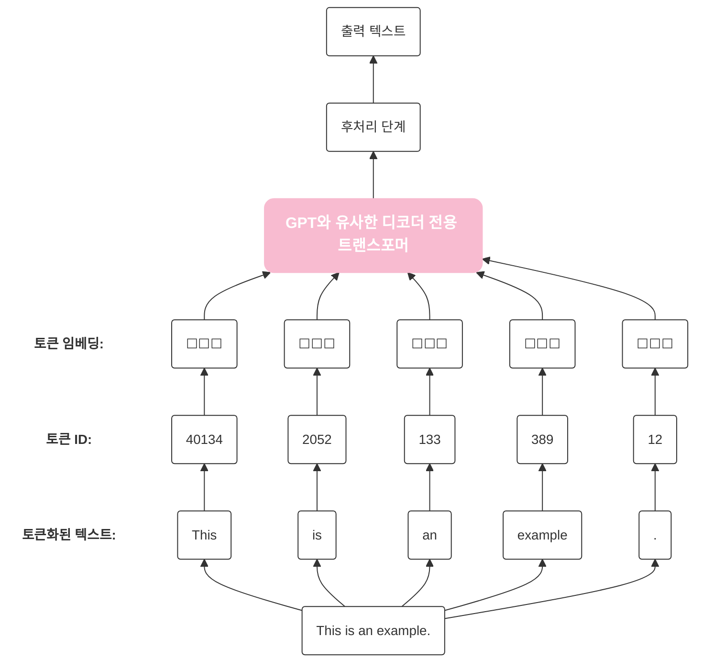

# 📖 Chapter: [CHAPTER2. 텍스트 데이터 다루기]

## 🧩 지식과 생각의 흐름 (Interleaved Notes)

> [!info] 책의 내용
> 심층 신경망 모델은 원시 텍스트를 바로 처리할 수 없으므로 단어를 실수 벡터로 표현할 방법이 필요.
> (토큰 id와 같은 정수로는 토큰 사이의 의도치 않는 순서 개념을 부여하게 되며, 이 정수를 원-핫 인코딩할 경우 모든 토큰 사이의 거리가 동일해져 비슷한 토큰 사이의 의미를 포착할 수 없음)
> 
> 데이터를 벡터 형태로 변환하는 개념을 **임베딩(embedding)**이라고 부름
> 비디오, 오디오, 텍스트등 다양한 종류의 데이터를 임베딩 할 수 있으나, 데이터 포맷마다 고유한 임베딩 모델이 필요
> 임베딩의 주요 목적은 비수치 데이터를 신경망이 처리할 수 있는 포맷(벡터)로 변환 하는 것
> 

> [!question] Q1. 원-핫 인코딩이란 뭐지?
> 원-핫 인코딩은 전체 단어의 개수만큼 빈칸(차원)을 만들고, 자기 자신의 자리에만 1을 킴
> 우리가 가진 전체 데이터(사전)에 단어가 딱 3개 뿐이라고 가정하면 `[사과, 바나나, 자동차]`
> - 사과: [1, 0, 0]
> - 바나나: [0, 1, 0]
> - 자동차: [0, 0, 1]
> 
> 그냥 1, 2, 3으로 안하고 이렇게 하는 이유
> 사과 = 1 / 바나나 = 2 / 자동차 = 3이라고 주면 컴퓨터는 수학적 계산기이기 때문에 "바나나가 사과보다 2배 크다", "사과 더하기 바나나는 자동차다."같은 어처구니 없는 수학적 오해가 생김(서열화 문제)
> 원-핫 인코딩은 모든 단어를 동등하게 독립적인 차원으로 찢어버리므로 이런 잘못된 관계 학습을 원천 차단함
> > [!warning] **원-핫 인코딩의 단점**
> > **1. 차원의 저주와 메모리 낭비**
> > 	- 단어 3개가 아닌 50만개의 단어를 인코딩 하게 되면 사과라는 단어 하나를 표현하기 위해 숫자 1개와 499,999개의 0이 들어간 거대한 배열을 메모리에 올려야 함.
> > 	
> > **2. 의미의 단절**
> >  - 수학적으로 이 벡터들은 서로 완전히 수직(직교)으로 교차함. 두 벡터를 곱해서(내적) 유사도를 구해보면 항상 0이 나옴.
> > 	 - `사과 [1, 0, 0]` x `바나나 [0, 1, 0]` = 0
> > 	 - `사과 [1, 0, 0]` x `자동차 [0, 0, 1]` = 0
> >  - 시스템 입장에서는 사과와 바나나는 과일이니까 비슷하다 라는 문맥을 전혀 알 수 없으며, 사과와 바나나나 사과와 자동차나 거리가 완전히 똑같이 멀게 느껴짐

> [!question] Q2. 인코딩을 정수로 하거나 원-핫 인코딩을 하면 문제가 생기는것은 알겠는데, 왜 하필 벡터로 인코딩?
> 벡터는 단어를 단순한 번호표가 아니라 **다차원 지도의 좌표(Coordinates)**로 만듬
> 시스템 아키텍처 관점에서 벡터가 혁명적인 이유 3가지
> 1. **차원의 세분화(다양한 속성의 저장)**
> 	- 정수는 1차원 선 위에 단어를 늘어놓는 것에 불과함. 벡터는 512차원, 1024차원이라는 거대한 다차원 공간을 사용하며, 이 수백 수천개의 차원(축)은 제각각 미묘한 의미를 담아냄.
> 	- 1번 차원: 성별을 나타내는 수치
> 	- 2번 차원: 왕족/귀족을 나타내는 수치
> 	- 3번 차원: 동물/식물을 나타내는 수치
> 	이런 식으로 한 단어가 가진 수많은 뉘앙스를 소수점 형태의 실수들로 쪼개서 정교하게 저장 가능
> 	
> 2. **기하학적 거리 측정(코사인 유사도)**
> 	- 좌표계가 생겼다는 것은 **'거리'**를 잴 수 있다는 뜻
> 	- 수많은 텍스트를 학습하는 과정에서, 같이 자주 쓰이는 단어들(예: 사과 / 바나나)은 다차원 공간에서 서로 중력처럼 끌어당겨져 좌표가 비슷해짐
> 	- 시스템은 두 벡터 사이의 각도(코사인 유사도)나 거리를 계산하여 "아 이 두 단어는 95%의 확률로 유사한 맥락을 가지는구나"라고 수학적 계산이 가능해짐
> 	
> 3. 의미의 연산(Vector Arithmetic)
> 	- 좌표계에 방향과 크기가 생겼기 때문에 **단어의 '의미'를 가지고 더하기 빼기 연산을 할 수 있게 됨**
> 	- 왕 - 남자 + 여자 = 여왕
>

---

> [!info] 책의 내용
> 단어 임베딩이 텍스트 임베딩의 가장 일반적인 형태
> 문장, 단락 또는 문서 전체를 위한 임베딩도 있음.
> 문장이나 단락 임베딩은 RAG(retrieval-augmented generation)에서 널리 사용
> 
> 초기에 등장한 단어 임베딩의 가장 인기있는 방법 중 하나는 **Word2Vec**
> 단어 임베딩의 차원은 하나에서 수천까지 가능. 차원이 높을수록 미묘한 관계를 잘 감지할 수 있지만 계산 효율성이 떨어짐
> 
> Word2Vec 같은 사전 훈련된 모델을 사용하여 머신러닝 모델을 위한 임베딩을 생성할 수도 있지만, LLM은 일반적으로 입력층의 일부로 자체적인 임베딩을 만들고 훈련중에 업데이트함.
> LLM 훈련의 일부로 임베딩을 최적화하면 임베딩을 특정 작업과 주어진 데이터에 최적화할 수 있다는 장점이 있음

---
> [!info] 책의 내용
> LLM을 위한 임베딩을 만드는 데 필수적인 전처리 단계인, 입력 텍스트를 개별 토큰으로 분할하는 방법은 개별 단어 또는 구두점 문자를 포함한 특수문자일 수 있음.



```python(title=2-1.py)
# "the-verdict.txt" 파일을 utf-8 인코딩의 읽기 모드("r")로 엽니다. (with 문이 끝나면 알아서 닫힙니다.)
with open("the-verdict.txt", "r", encoding="utf-8") as f:
    # 해당 텍스트 파일의 전체 내용을 불러와 하나의 문자열로 변수(raw_text)에 저장합니다.
    raw_text = f.read()
    # 전체 문자열의 길이(문자 및 기호의 총 개수)를 계산해서 화면에 출력합니다.
    print("총 문자 개수:", len(raw_text))
    # 데이터가 잘 불러와졌는지 확인하기 위해 처음부터 99개의 문자까지만 잘라서 출력해봅니다.
    print(raw_text[:99])
```

```
```
---
## 🧐 최종 갈무리 (Synthesis)
*챕터를 마친 후, 전체 내용을 관통하는 나만의 결론을 내립니다.*

- **한 줄 정의:** 이 챕터는 결국 [ ]를 해결하기 위한 [ ]의 중요성을 말하고 있다.
- **핵심 Insight:** 기술적 복잡도를 낮추기 위해서는 단순한 구현보다 '책임의 분리'가 선행되어야 함을 다시 한번 깨달음.
- **남겨진 숙제:** 다음 장에서 설명할 [ ] 개념과 이 내용이 어떻게 연결될지 지켜볼 것.